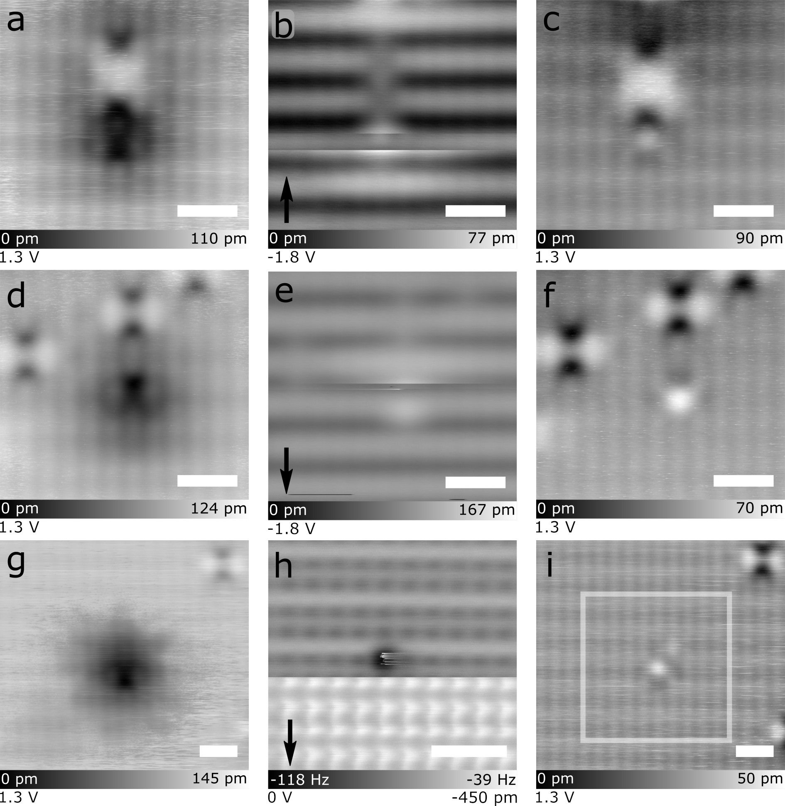

# FP-2 figure sheet

Draft for review · 17 September 2026 · Companion to the [student worksheet](student-worksheet.md)

This sheet reproduces only figures whose reuse basis has been verified from the source version's own licence notice. Attribution, legibility and classroom use still need review; no walkthrough has been recorded.

## A. Seibert et al. (2020), Fig. 2a–b — not reproduced

Read Fig. 2a–b and pp. 7790–7791 in the [publisher version](https://doi.org/10.1021/acs.langmuir.0c00748). Access may require an institutional subscription.

The figure is not reproduced here. The earlier CC BY record for this article was withdrawn on 17 September 2026, and its redistribution permission is unverified (see [rights](../RIGHTS.md) and decision D15 in the [decision record](../docs/decisions.md)). Reproduce it only after permission for the exact version and figure has been verified and recorded in the [manifest](../literature/source-manifest.md).

## B. Croshaw et al. (2020), Fig. 5



**Original caption, reproduced unchanged:** "Figure 5: Tip-induced removal of hydrogen atoms decorating neutral point defects. (a–c), (d–f), and (g–i) show three instances of the apparent neutralization of a negatively charged defect. (a,d,g) Empty states images of the negatively charged H-decorated point defect before H liberation. (b,e) Show filled states STM removal events, while (h) shows an AFM removal event. The arrows in the lower left indicate the scan direction, with contrast changes in the scan indicating a removal event has occurred. (c,f,i) Empty states STM images of the same frames as (a,d,g), but after the H removal. The point defects no longer display charge-induced band bending around their location. The white box in (i) indicates the size of the scan frame in (h). Scale bars are 1 nm."

**Credit:** Figure 5 from J. Croshaw, T. Dienel, T. Huff and R. Wolkow, "Atomic defect classification of the H–Si(100) surface through multi-mode scanning probe microscopy", *Beilstein J. Nanotechnol.* **11**, 1346–1360 (2020), [doi:10.3762/bjnano.11.119](https://doi.org/10.3762/bjnano.11.119). © 2020 Croshaw et al.; licensee Beilstein-Institut. Licensed under [CC BY 4.0](https://creativecommons.org/licenses/by/4.0/). Figure and caption unmodified.

### Reading the panels

The rows are three separate sequences, not nine frames of one experiment. Settings below are transcribed from the text printed on each panel.

| Sequence | Before | Probe interaction | After |
|---|---|---|---|
| 1 | (a) 1.3 V; colour scale 0–110 pm | (b) −1.8 V; 0–77 pm; scan arrow points up | (c) 1.3 V; 0–90 pm |
| 2 | (d) 1.3 V; 0–124 pm | (e) −1.8 V; 0–167 pm; scan arrow points down | (f) 1.3 V; 0–70 pm |
| 3 | (g) 1.3 V; 0–145 pm | (h) AFM: 0 V; colour scale −118 to −39 Hz; −450 pm; scan arrow points down | (i) 1.3 V; 0–50 pm; white box marks the size of the (h) frame |

How to read the printed settings, according to the paper:

- **Voltage:** in the convention the paper states for Fig. 1 (p. 1347), the lower-left value is the sample bias. The caption calls the 1.3 V images "empty states" and (b, e) "filled states".
- **Colour scales:** the colour bar gives the displayed range, as apparent height (pm) for STM or frequency shift (Hz) for AFM.
- **Height offset:** in (h), −450 pm is the height offset. The paper references such offsets to a tunnelling setpoint of 50 pA and −1.8 V over an H–Si atom (Fig. 1 caption, p. 1348; Methods, p. 1357).
- **Scale bars:** all are 1 nm, but they are drawn at different lengths, so the frames are different sizes. Do not compare feature sizes across panels by eye.

**Context from Methods (p. 1357):**
- **Instruments:** an Omicron LT STM and an Omicron qPlus LT AFM, both at 4.5 K in ultrahigh vacuum.
- **Samples:** highly arsenic-doped Si(100) (≈1.5 × 10¹⁹ cm⁻³), hydrogen-terminated in situ.
- **Tips:** AFM tip terminations were formed by controlled contact with the surface.

**Not stated in the caption or the discussion on p. 1356:**
- which instrument recorded each sequence
- the tunnelling current for these frames
- acquisition times or the interval between panels

Supporting Information Figures S16–S17 give further removal examples; they were not reviewed for this sheet.

### Observation or assignment?

The caption combines what is visible with what the authors conclude. When you use this figure, record these separately:

- **Visible in the images:** contrast, discontinuities, scan direction and printed settings.
- **Assigned by the authors:** for example "H-decorated", "removal event", "neutralization", or a change of tip apex (p. 1356). Give the caption or page for each assignment.

## Attribution and reuse record

| Item | Record |
|---|---|
| Authors | Jeremiah Croshaw, Thomas Dienel, Taleana Huff, Robert Wolkow |
| Title | Atomic defect classification of the H–Si(100) surface through multi-mode scanning probe microscopy |
| Publication | *Beilstein J. Nanotechnol.* 2020, 11, 1346–1360; published 7 September 2020 |
| DOI | [10.3762/bjnano.11.119](https://doi.org/10.3762/bjnano.11.119) |
| Figure | Figure 5, p. 1356 |
| Source copy | [`sources/croshaw-2020.pdf`](../sources/croshaw-2020.pdf), SHA-256 `f56663aa68f4100368d6b7417dd50002af719d9593a661bf4c3ce369a4699a8c` (see [manifest](../literature/source-manifest.md)) |
| Reproduced file | [`figures/croshaw-2020-fig5.jpg`](figures/croshaw-2020-fig5.jpg), 381,062 bytes, 1890 × 1941 px, SHA-256 `6ac6501bbd3624fe95843a8d78051c3cba6681136f86e9dac05199735371e46f` |
| Extraction | Embedded JPEG stream (PDF page 11, object 321) written out with `pdfimages -j`; bytes identical to the stream, not re-encoded |
| Licence and basis | [CC BY 4.0](https://creativecommons.org/licenses/by/4.0/), stated in the article's own "License and Terms" notice, subject to the Beilstein Journal of Nanotechnology terms and conditions. The notice asks that authors and source are credited. Crossref also records CC BY 4.0 for the version of record |
| Copyright notice | © 2020 Croshaw et al.; licensee Beilstein-Institut |
| Figure-specific notices | None found in the caption or article text |
| Modifications | None to the figure or caption. Headings, the panel table and reading notes are new project text and not part of the licensed work |
| Checked | 17 September 2026 |

To reproduce the extraction from the source copy:

```sh
pdfimages -j -f 11 -l 11 sources/croshaw-2020.pdf /tmp/fig5
shasum -a 256 /tmp/fig5-000.jpg
```
